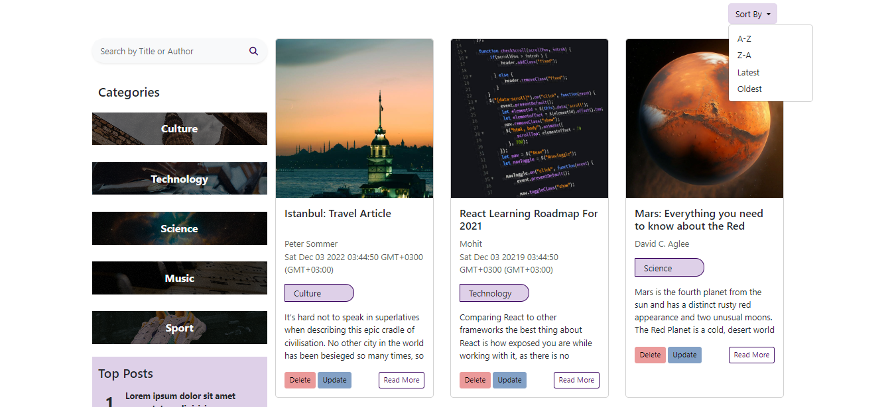
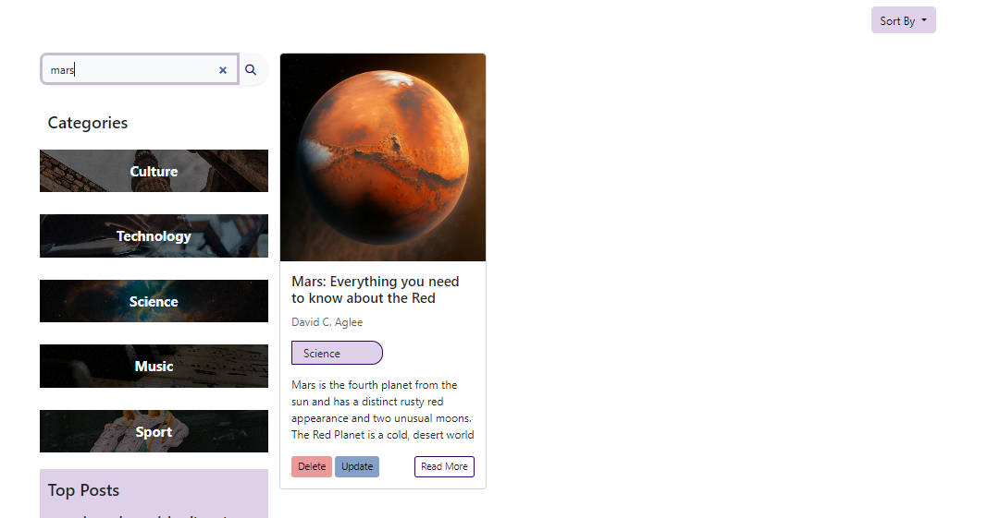
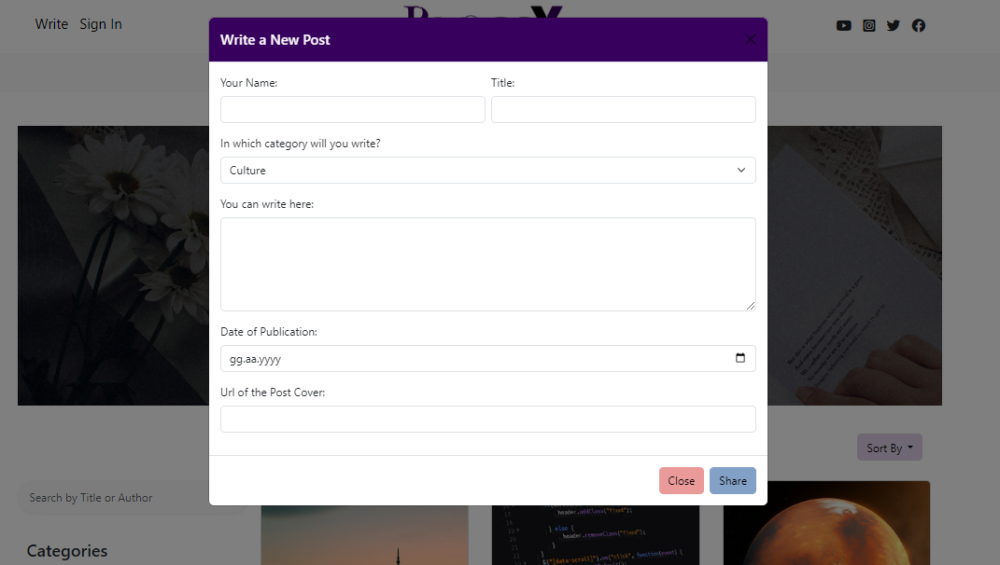
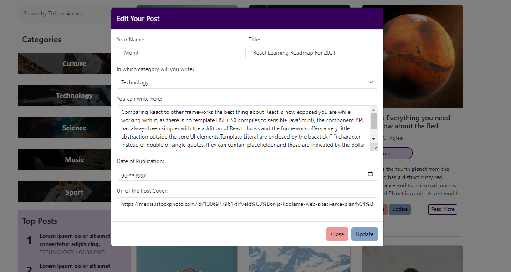
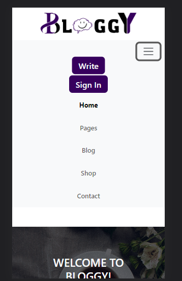
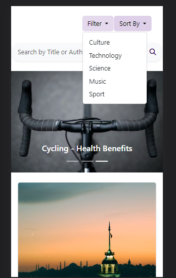
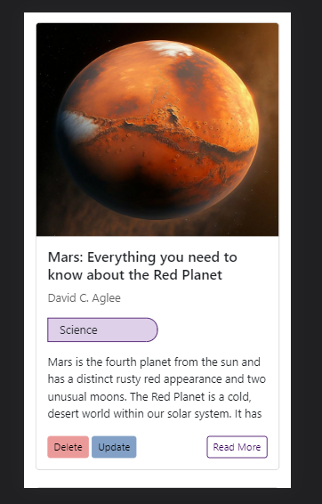

# BloggY

Bloggy, çeşitli kategorilerde yazılar bulabileceğiniz ve yeni yazılar yazabileceğiniz bir blog sayfası şablonudur. Projede veriler **Fetch** ile **posts.json** isimli dosyadan çekilmektedir. Sayfa **responsive** bir yapıya sahiptir.

---

### Kullanılan Teknolojiler

* HTML
* SCSS
* JavaScript
* Bootstrap

---

### Fonksiyonlar

* Yeni yazı ekleme
* Eklenmiş bir yazının içeriğini güncelleme
* Yazıyı Silme
* Yazının içeriğini ayrıntılı görüntüleme
* Kategorilere göre yazıları filtreleme
* Yazının başlığına veya yazarına göre arama yapabilme
* Alfabetik olarak veya yayın tarihine göre sıralama yapabilme

---

### Görseller

